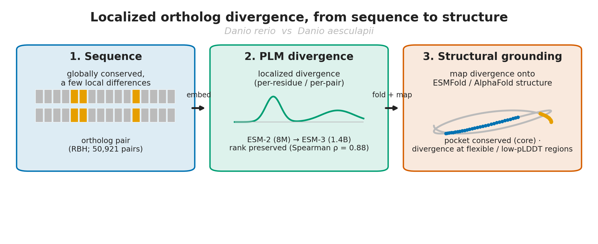
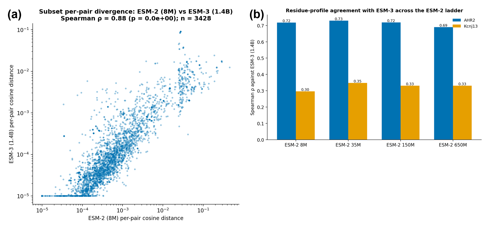
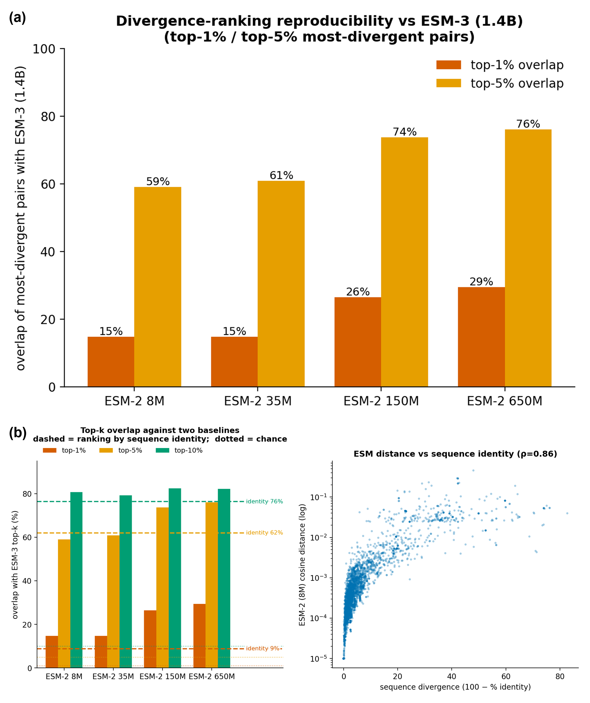
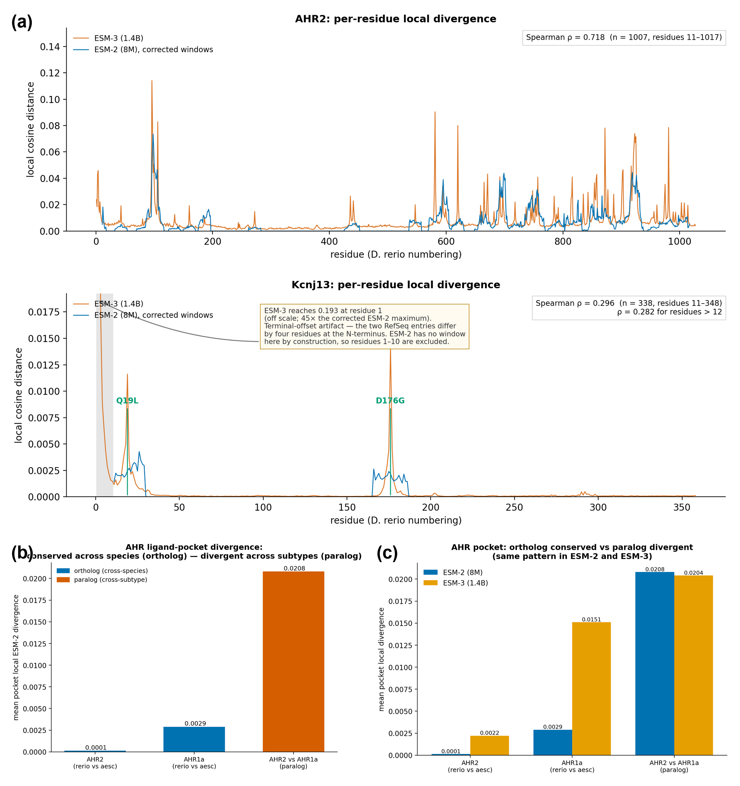
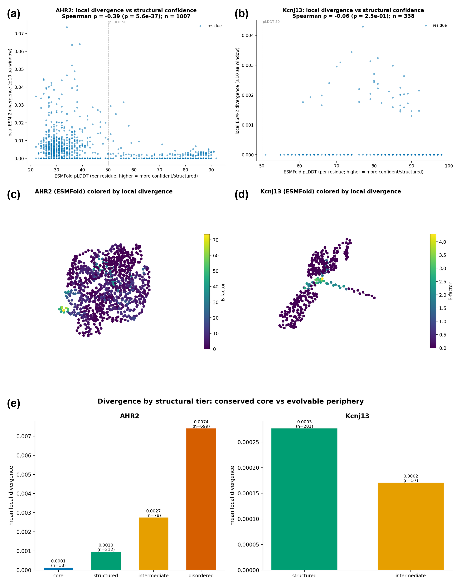
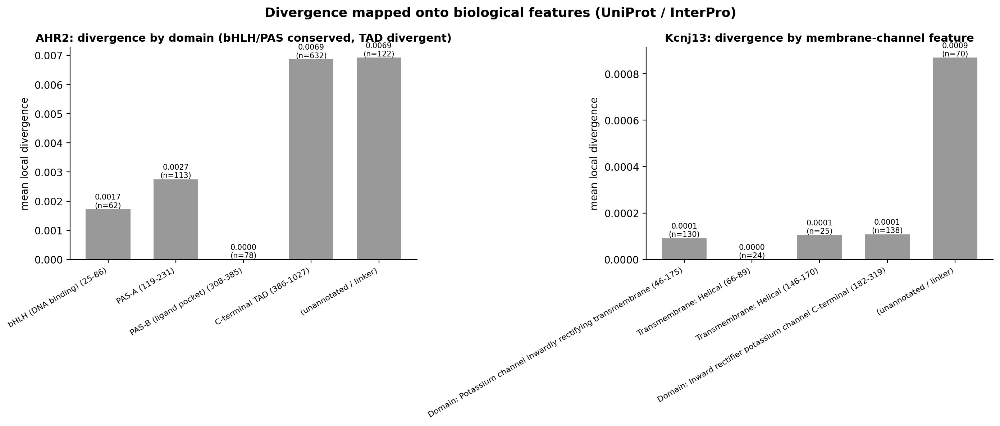
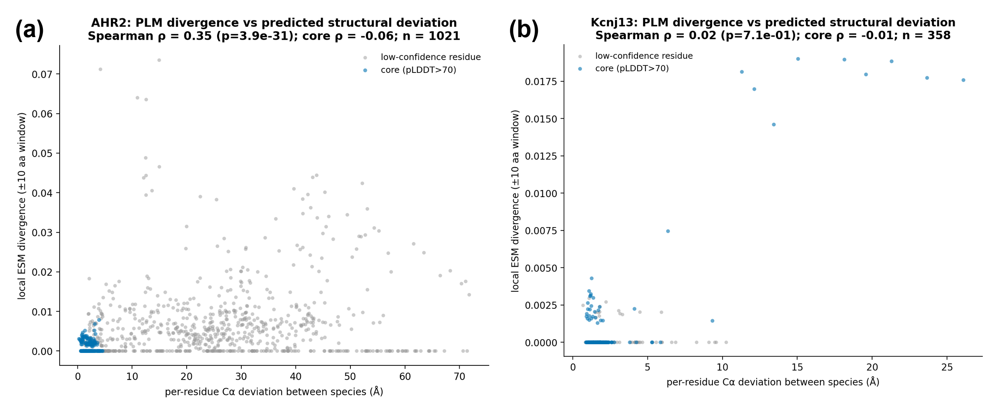
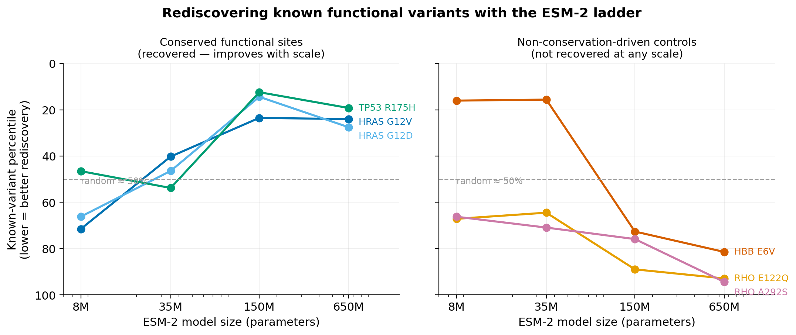
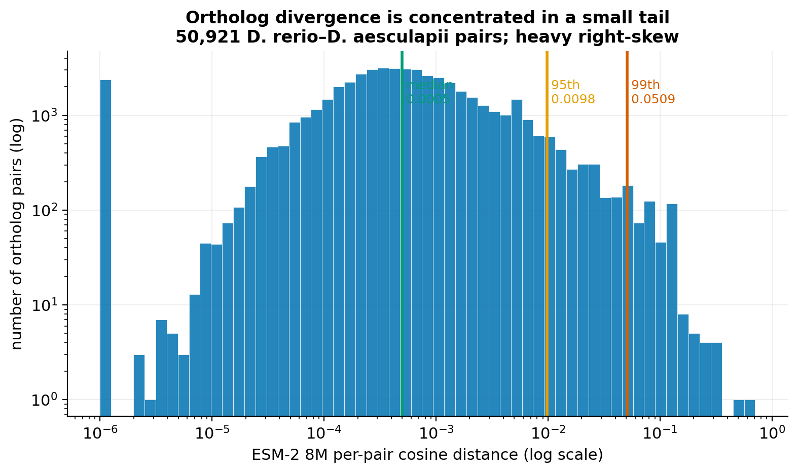
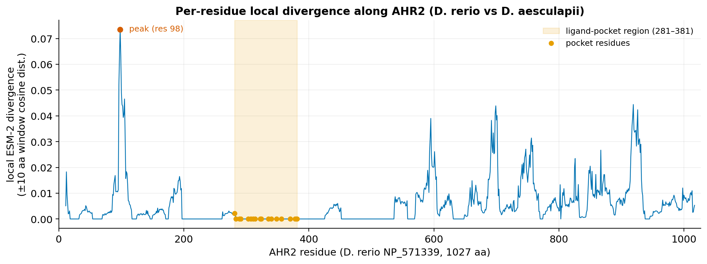

# Figures (preview)

All figures for the follow-up manuscript, displayed inline so they can be viewed on
GitHub without downloading anything. Legends are the same text as in
[`FIGURES_en.md`](../../docs/FIGURES_en.md).

**Download everything as one file:** [`ALL_FIGURES.pdf`](ALL_FIGURES.pdf)
(right-click → Save link as, or open it and use the download button).

---

## Figure 1

> Overview of the analysis. Orthologous protein pairs between Danio rerio and Danio aesculapii are globally conserved but differ at a small number of positions (left). Protein language model embeddings convert these differences into a per-pair and per-residue divergence signal (centre), which is then mapped onto ESMFold-predicted structures and domain annotation to ask where in the protein the divergence lies (right). The study asks two questions of this pipeline: whether the divergence ranking survives a change of model scale and architecture, and whether the divergence is structurally grounded.

---

## Figure 2

> Per-pair embedding divergence is compared between models over 3,428 stratified ortholog pairs. (a) Cosine distance from ESM-2 (8M) against ESM-3 (1.4B); both axes logarithmic. Absolute distances differ between the two embedding spaces, but the rank ordering is strongly preserved (Spearman ρ = 0.881, 95% CI 0.870–0.891 by bootstrap over pairs, n = 3,428). (b) Rank agreement with ESM-3 for each ESM-2 checkpoint (8M, 35M, 150M, 650M) at the per-pair and per-residue level; agreement is essentially flat across a 175-fold range of parameter count.

---

## Figure 3

> Reproducibility of the candidate list. (a) Overlap of the most divergent pairs identified by each ESM-2 size with those identified by ESM-3, at the top-1% and top-5% thresholds; overlap increases monotonically with model size (top-5%: 59%, 61%, 74%, 76%). (b) The same overlap plotted against two baselines: the expectation for two independent rankings (dashed lines) and, more demandingly, the overlap achieved by ranking the same pairs by sequence identity alone (8.8%, 62.0% and 76.4% at top-1%, -5% and -10%). ESM-2 8M exceeds the identity baseline at top-1% and top-10% but not at top-5%; 150M and 650M exceed it at every threshold. (c) ESM-2 (8M) cosine distance against sequence divergence (100 − % identity); the two are correlated (Spearman ρ = 0.86) but the relationship saturates and scatters at the high identities that dominate this comparison (median 96.9%), and a partial rank correlation controlling for identity leaves ρ = 0.603 between ESM-2 and ESM-3.

---

## Figure 4

> (a) Per-residue local divergence profiles computed with ESM-2 (8M) and ESM-3 (1.4B) for AHR2 and Kcnj13. Profiles agree in rank (AHR2 Spearman ρ = 0.715, peak residue 98 vs 96). For Kcnj13 the corrected ESM-2 profile resolves the two substitutions separating the species, Q19L and D176G; agreement with the ESM-3 profile is ρ = 0.296 with 79% top-decile overlap (ρ = 0.282, 82% restricted to residues ≥ 13). The ESM-3 profile is itself contaminated at the N-terminus by the four-residue insertion in D. aesculapii — its five highest residues are artifact and the next five are the genuine substitutions (Results §3.2). (b) Mean local divergence at the AHR ligand-pocket residues on two axes, each normalized against whole-protein divergence: ortholog AHR2 1.21e-4 (0.022 of background), ortholog AHR1a 2.90e-3 (0.150), paralog AHR2 vs AHR1a 2.08e-2 (0.497). The pocket is conserved relative to its own protein on both axes, most strongly between species (permutation p = 0.0002). (c) The same comparison under ESM-2 and ESM-3; the ortholog < paralog ordering holds under both models.

---

## Figure 5

> Per-residue divergence mapped onto ESMFold predictions. (a,b) Local divergence against per-residue confidence (pLDDT). For AHR2 the two are negatively correlated (Spearman ρ = −0.385) and 96.0% of top-decile divergent residues fall below pLDDT 50; Kcnj13 is almost entirely structured and has no low-confidence regions. (c,d) Predicted structures coloured by local divergence. (e) Mean local divergence by structural tier. For AHR2 the gradient is monotonic from the annotated functional core (ligand pocket, 1.2e-4) through structured non-core (9.6e-4) and intermediate confidence (2.7e-3) to predicted-disordered residues (7.4e-3), a ~60-fold range. Kcnj13 has no disordered tier and, after the correction described in Results §3.7, no periphery gradient: its entire interspecies difference is the two substitutions shown in Figure 4a.

---

## Figure 6

> Mean local divergence per annotated feature, with coordinates retrieved from InterPro (AHR2) and UniProt (Kcnj13) and transferred to the reference numbering by global alignment; intervals are stated because two InterPro signatures give different boundaries for AHR2 PAS-B, and because keying features by name alone conflates the two identically labelled Kcnj13 transmembrane helices (Results §3.7). Left, AHR2: the ligand-binding PAS fold (308–385) shows no divergence detectable above the float32 noise floor, the DNA-binding bHLH domain (25–86) and PAS-A (119–231) are low (1.72e-3, 2.75e-3), and divergence is carried by the C-terminal transactivation domain (386–1027; 6.86e-3). Right, Kcnj13: every annotated channel element is at or near zero — TM1 (66–89) 3.0e-8, TM2 (146–170) 1.05e-4, inward-rectifier transmembrane domain (46–175) 9.1e-5, Kir C-terminal cytoplasmic domain (182–319) 1.08e-4 — while the unannotated remainder (8.7e-4) contains both substitutions separating the species, Q19L and D176G.

---

## Figure S1

> Methodological control. The two species' independently predicted ESMFold structures were superposed on their shared confident core (both pLDDT > 70) and the per-residue Cα deviation was correlated with local embedding divergence. Kcnj13 shows no relationship (Spearman ρ = 0.02). AHR2 shows an apparent relationship overall (ρ = 0.35) that disappears when restricted to the structured core (ρ = −0.06), identifying it as a disordered-region confound. Between orthologs of ~97% identity, the deviation between two single-sequence predictions is dominated by prediction variance and should not be used as a measure of structural divergence.

---

## Figure S2

> Scope of the underlying signal. For each positive-control variant, the full single-substitution scan (L × 19) was computed with ESM-2 and the known variant's percentile among all substitutions in the same protein is plotted against model size, for all four sizes and both scoring schemes. Variants at conservation-constrained functional sites (HRAS G12V/G12D, TP53 R175H) improve from 8M to 150M (to the 12–24th percentile) but degrade again at 650M, so scaling is not monotonic. HBB E6V is recovered by the two smallest models (13.9 and 11.4 percentile) and lost from 150M upward. Only the rhodopsin wavelength-tuning substitutions are missed at every size.

---

## Figure S3

> Distribution of ESM-2 (8M) per-pair cosine distance over the de-duplicated ortholog set (50,921 unique pairs) carried over from the previous study, showing the strongly right-skewed shape from which the stratified subset was drawn.

---

## Figure S4

> Full per-residue local divergence profile for AHR2 (D. rerio vs D. aesculapii), with domain boundaries indicated.

---
